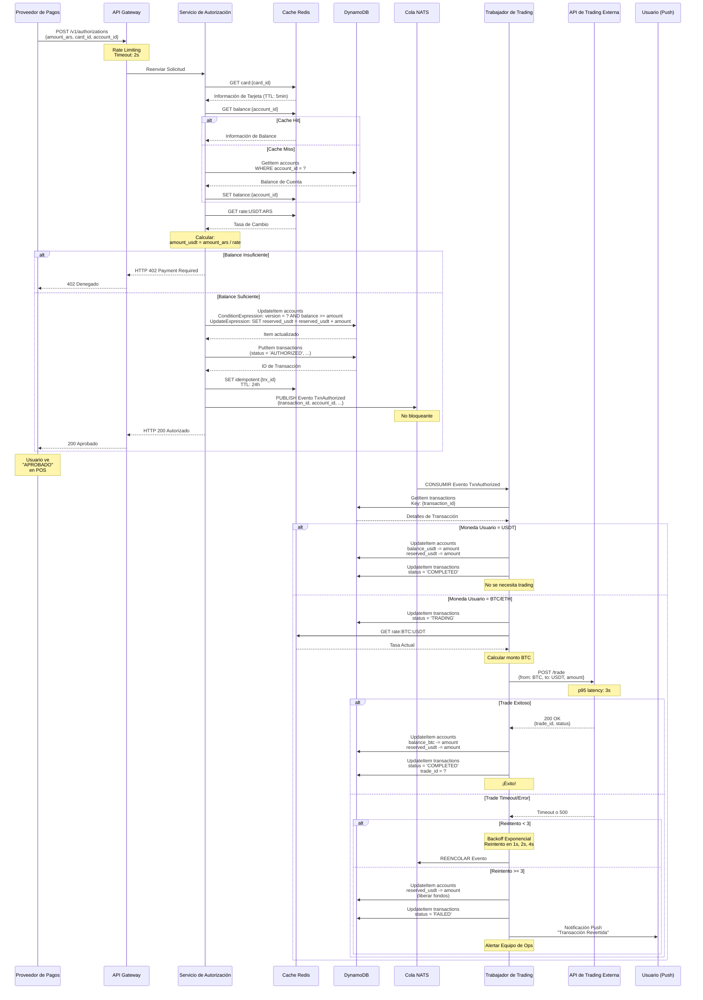
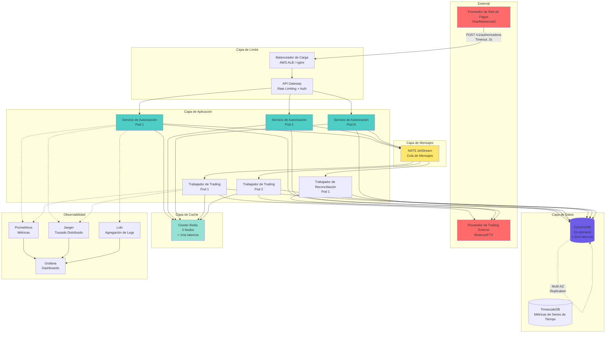
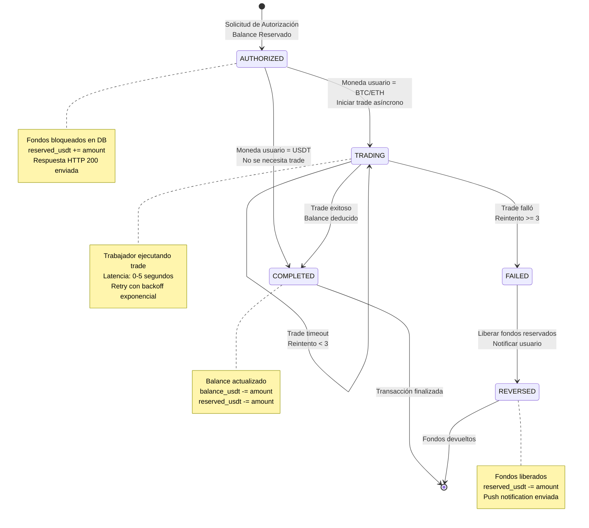
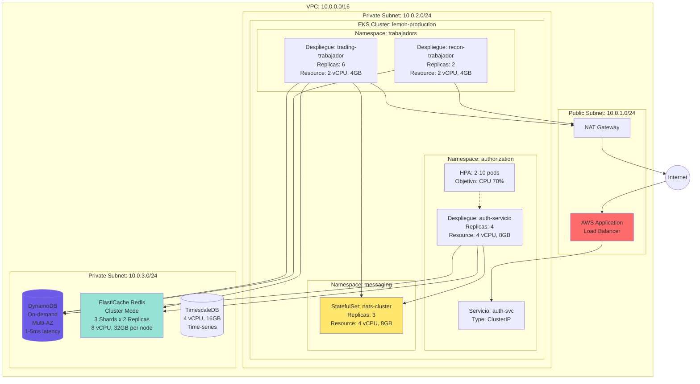
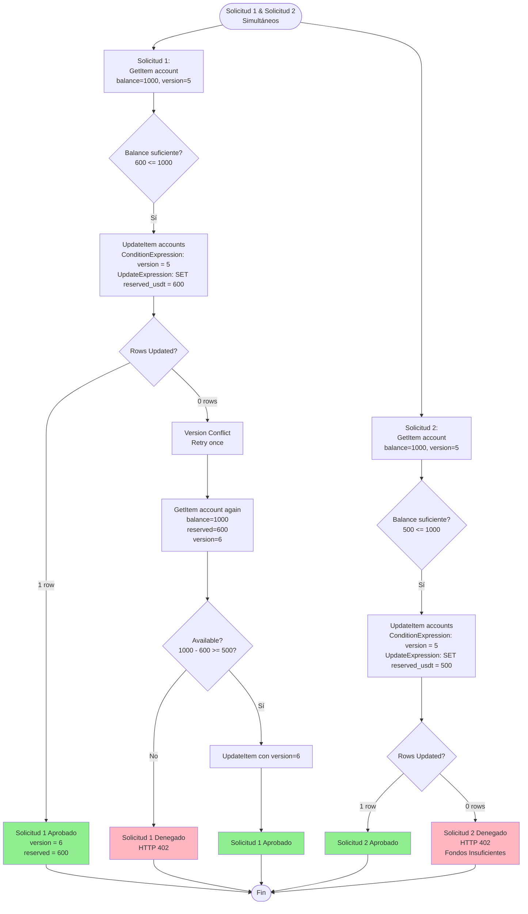
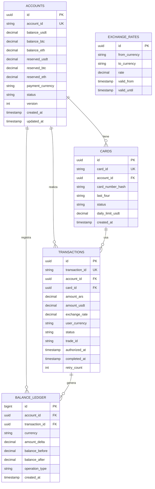
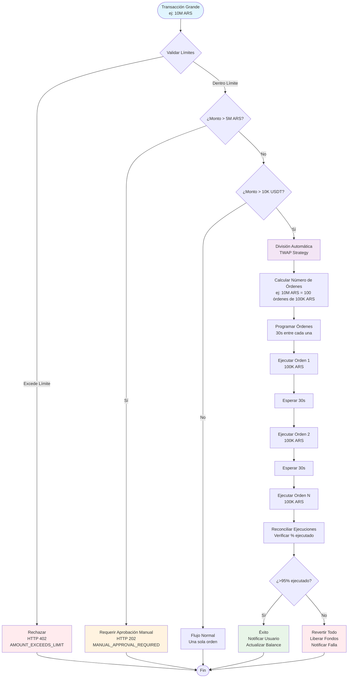

# Diagramas de Arquitectura

## Diagrama de Secuencia: Flujo Completo de Autorización

---

## Diagrama de Arquitectura: Componentes y Flujo de Datos

---

## Diagrama de Estados: Ciclo de Vida de Transacción

---

## Diagrama de Infraestructura: Despliegue en Kubernetes

---

## Diagrama de Flujo: Manejo de Concurrencia de Saldo

---

## Diagrama de Componentes: Trabajador de Trading con Circuit Breaker

```mermaid
graph TB
    subgraph "Trabajador de Trading"
        Consumer[Consumidor NATS<br/>Concurrencia: 50]
        
        Consumer --> Processor[Procesador de Eventos]
        
        Processor --> CB{Estado Circuit Breaker?}
        
        CB -->|CERRADO| Execute[Ejecutar Trade]
        CB -->|ABIERTO| Skip[Omitir Trade<br/>Marcar PENDING_TRADE<br/>Reintentar después]
        CB -->|SEMI_ABIERTO| Test[Solicitud de Prueba<br/>1 de 3]
        
        Execute --> API[API de Trading Externa<br/>POST /trade]
        Test --> API
        
        API -->|Éxito| Success[Actualizar Estado:<br/>COMPLETED]
        API -->|Error| Error[Manejar Error]
        API -->|Timeout| Timeout[Manejar Timeout]
        
        Success --> UpdateDB[(Actualizar DynamoDB)]
        
        Error --> ErrorCount{Tasa de Error<br/>> 50%?}
        ErrorCount -->|Sí| OpenCB[Abrir Circuito<br/>Por 30s]
        ErrorCount -->|No| Retry[Reintentar con<br/>Backoff]
        
        Timeout --> RetryTimeout[Reintentar con<br/>Backoff]
        
        RetryTimeout --> RetryCount{Reintento<br/>< 3?}
        RetryCount -->|Sí| Recola[Reencolar Evento<br/>+1s, +2s, +4s]
        RetryCount -->|No| Failed[Marcar FAILED<br/>Revertir Transacción]
        
        Retry --> RetryCount
        
        OpenCB --> Alert[Alertar Equipo de Ops]
        Failed --> Notification[Notificación Push<br/>al Usuario]
        
        Recola --> Consumer
    end
    
    subgraph "Circuit Breaker States"
        StateClosed[CLOSED<br/>Normal Operation<br/>All solicituds pass]
        StateOpen[OPEN<br/>All solicituds fail fast<br/>Duration: 30s]
        StateHalf[HALF_OPEN<br/>Test with limited solicituds<br/>3 attempts]
        
        StateClosed -->|Error rate > 50%| StateOpen
        StateOpen -->|After 30s| StateHalf
        StateHalf -->|3 success| StateClosed
        StateHalf -->|Any failure| StateOpen
    end
    
    style Success fill:#90EE90
    style Failed fill:#FFB6C1
    style OpenCB fill:#FFA500
```

---

## Diagrama de Datos: Relaciones entre Entidades

---

## Diagrama de Latencias: Presupuesto de Tiempo (2 segundos)

```mermaid
gantt
    title Presupuesto de Tiempo de Solicitud de Autorización (Objetivo: < 500ms)
    dateFormat SSS
    axisFormat %L ms
    
    section Procesamiento de Solicitud
    API Gateway (Rate Limit + Auth) :done, gw, 000, 20ms
    
    section Servicio de Autorización
    Validar Esquema de Solicitud :done, val, after gw, 5ms
    Obtener Info de Tarjeta (Redis) :done, card, after val, 15ms
    Obtener Balance de Cuenta (Redis) :done, bal, after card, 20ms
    Obtener Tasa de Cambio (Redis) :done, rate, after bal, 10ms
    Calcular y Validar Balance :done, calc, after rate, 5ms
    
    section Operaciones de Base de Datos
    Reservar Balance (UpdateItem) :crit, reserve, after calc, 80ms
    Crear Transacción (PutItem) :crit, insert, after reserve, 60ms
    
    section Operaciones Asíncronas
    Publicar a Cola NATS :done, pub, after insert, 15ms
    Cachear Clave de Idempotencia :done, cache, after pub, 10ms
    
    section Respuesta
    Construir y Enviar HTTP 200 :done, resp, after cache, 10ms
    
    section Total
    TIEMPO TOTAL SÍNCRONO :milestone, after resp, 0ms
```

**Desglose:**
- **Objetivo:** 250-500ms (p95)
- **Buffer:** 1500ms disponible para picos
- **Ruta Crítica:** Operaciones de base de datos (140ms)
- **Optimización:** Aciertos en cache reducen latencia a ~50ms

---

## Diagrama de Flujo: Manejo de Montos Grandes

---

## Notas de Implementación

### Consideraciones de Rendimiento

1. **Connection Pooling:**
   - DynamoDB: On-demand billing con auto-scaling
   - Redis: Pool de 50 conexiones por instancia
   - NATS: 10 conexiones por trabajador

2. **GSI Críticos:**
   - accounts: user-accounts (user_id, created_at)
   - transactions: status-transactions (status, created_at)
   - cards: account-cards (account_id, created_at)

3. **Conditional Writes:**
   - Todas las operaciones críticas usan conditional writes
   - Garantiza atomicidad sin transacciones

4. **Batch Operations:**
   - Reconciliation trabajador procesa en batches de 100 transacciones
   - Reduce round-trips a DynamoDB

### Despliegue Strategy

1. **Blue-Green Despliegue:**
   - Zero downtime despliegues
   - Rollback inmediato si hay issues

2. **Canary Releases:**
   - 10% → 50% → 100% tráfico
   - Monitoreo automático de error rates

3. **Database Migrations:**
   - Online schema changes (gh-ost / pt-online-schema-change)
   - No locking de tablas

### Disaster Recovery

1. **Backup Strategy:**
   - DynamoDB: Point-in-time recovery + cross-region backup
   - Redis: RDB snapshots cada 5 minutos
   - Retention: 30 días

2. **RTO/RPO:**
   - RTO: < 1 hora (Recovery Time Objective)
   - RPO: < 5 minutos (Recovery Point Objective)

3. **Failover:**
   - Automático para Redis y DynamoDB
   - Manual para NATS (requiere validación)

