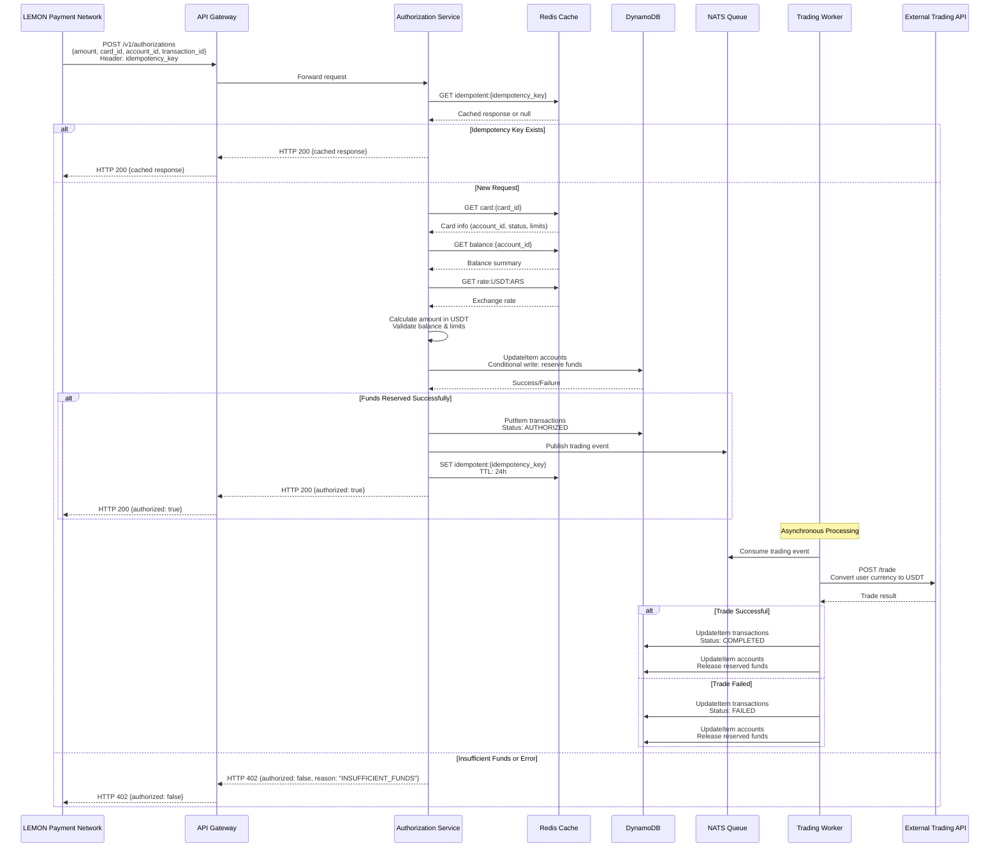
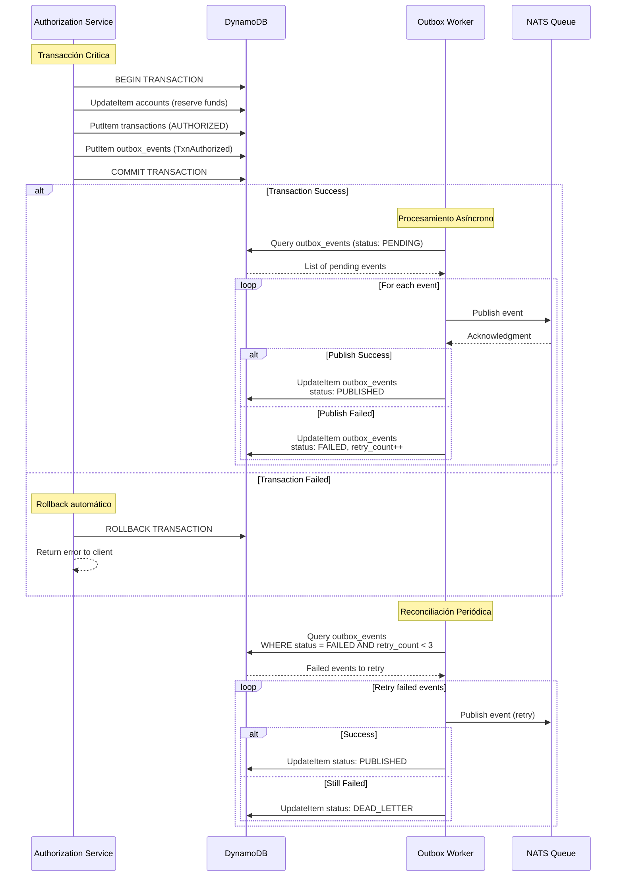
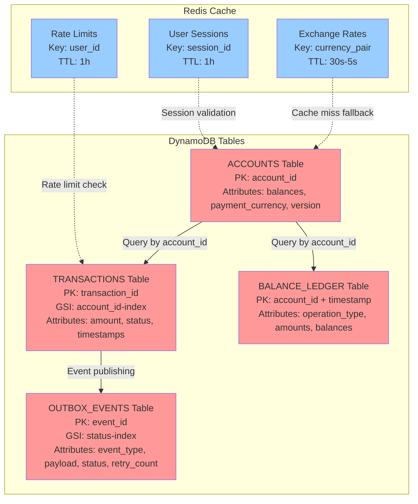

# Diagramas de Arquitectura

## Diagrama de Secuencia: Flujo Completo de Autorización

---

## Diagrama de Arquitectura: Componentes y Flujo de Datos

---

## Diagrama de Estados: Ciclo de Vida de Transacción

---

## Diagrama de Patrón Outbox: Manejo de Fallas Intermedias

---

## Diagrama de Datos: Estructura NoSQL (DynamoDB)

---

## Diagrama de Latencias: Presupuesto de Tiempo (2 segundos)

**Desglose:**
- **Objetivo:** 250-500ms (p95)
- **Buffer:** 1500ms disponible para picos
- **Ruta Crítica:** Operaciones de base de datos (140ms)
- **Optimización:** Aciertos en cache reducen latencia a ~50ms