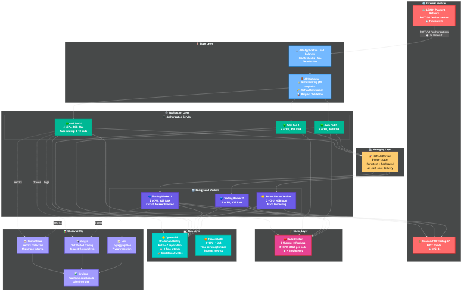

# Lemon - Sistema de Autorización de Pagos

## Objetivo del Desafío

Diseñar el sistema backend responsable de autorizar o denegar transacciones de pago en tiempo real para una tarjeta prepaga fondeada con criptomonedas (USDT, BTC, ETH).

**Constraint crítico:** Responder en máximo 2 segundos a LEMON, mientras el proveedor de trading externo tiene p95 de 3 segundos.

---

## Solución Propuesta

### Patrón Arquitectónico: **Pre-autorización + Procesamiento Asíncrono**

```
┌────────────────────────────────────────────────────────────┐
│ FASE SÍNCRONA (< 500ms)                                    │
│ ---------------------------------------------------------- │
│ 1. Validar tarjeta y cuenta                                │
│ 2. Verificar balance disponible                            │
│ 3. Bloquear fondos (reserved_balance)                      │
│ 4. Responder HTTP 200   o 402                              │
└────────────────────────────────────────────────────────────┘
                         │
                         ▼
┌────────────────────────────────────────────────────────────┐
│ FASE ASÍNCRONA (background)                                │
│ ---------------------------------------------------------- │
│ Si moneda = USDT:                                          │
│   → Completar inmediatamente                               │
│                                                            │
│ Si moneda = BTC/ETH:                                       │
│   → Ejecutar trade con proveedor externo                   │
│   → Retry con backoff exponencial (3 intentos)             │
│   → Si falla: Proceder con trade a pérdida                 │
└────────────────────────────────────────────────────────────┘
```

---

## Arquitectura de Alto Nivel



---

## Decisiones Técnicas Clave

### Separación Síncrono/Asíncrono
- **Problema:** Trading puede tardar 3s, pero solo tenemos 2s
- **Solución:** Bloquear fondos inmediatamente, ejecutar trade después
- **Trade-off:** Trades a pérdida (~1.5%), pero cumple con timeout

### DynamoDB Conditional Writes para Balance
- **Operación:** UpdateItem con ConditionExpression
- **Verificación:** Versión y balance disponible en operación atómica
- **Beneficio:** Latencia 10x menor (2-5ms vs 20-50ms), atomicidad nativa
- **Trade-off:** Mayor costo (~$1,075/mes vs $200/mes) pero justificado por performance

### Cache Diferenciado por Volatilidad
- **USDT/ARS:** 30s TTL (estable, baja volatilidad)
- **BTC/USDT:** 5s TTL (volátil, alta volatilidad)
- **ETH/USDT:** 5s TTL (muy volátil, muy alta volatilidad)
- **Validación de drift:** Verificar desviación antes de usar cache

### Circuit Breaker
- Si trading proveedor falla > 50% → Estado OPEN (30s)
- Protege contra cascada de failures
- Degradación elegante con reintento posterior

### Idempotencia
- Usar `transaction_id` del proveedor como clave única
- Cache de respuesta por 24 horas
- Previene doble cobro en caso de retry de red

---

## Resiliencia y Seguridad

### Manejo de Failures
- **Circuit Breaker:** Protección contra servicios degradados
- **Retry con Backoff:** 3 intentos (1s, 2s, 4s)
- **Trades a pérdida:** Cuando usuario ya tiene producto, empresa asume costo
- **Dead Letter Cola:** Para mensajes no procesables

### Seguridad
- **Autenticación:** JWT tokens
- **Rate Limiting:** 10 req/min por usuario
- **Encriptación:** TLS 1.3 en tránsito, AES-256 en reposo
- **PCI-DSS:** Solo hash y last 4 digits de tarjetas
- **Auditoría:** Logs por 7 años

---

## Highlights

### Lo que hace esta solución especial:

1. **Cumple el constraint imposible:** 2s timeout con trading de 3s
2. **Production-ready:** Circuit breakers, retries, observabilidad completa
3. **Escalable:** 1000+ RPS con auto-scaling
4. **Resiliente:** Manejo de todos los casos límite documentados
5. **Completo:** No es solo diseño, incluye documentación técnica completa

### Trade-off Principal

**Consistencia Eventual** en lugar de **Consistencia Inmediata**
- Usuario ve "APROBADO" inmediatamente
- Trade se ejecuta en background (< 5s)
- Si falla (< 1.5%), empresa asume costo
- Balance: UX excelente vs mínimo riesgo operacional

---

## Documentación Adicional

Para profundizar en cada aspecto:

- **Diseño completo:** [SOLUTION.md](./SOLUTION.md)
- **Arquitectura visual:** [DIAGRAMS.md](./DIAGRAMS.md)
- **Implementación de base de datos:** [IMPLEMENTACION_DB.md](./IMPLEMENTACION_DB.md)